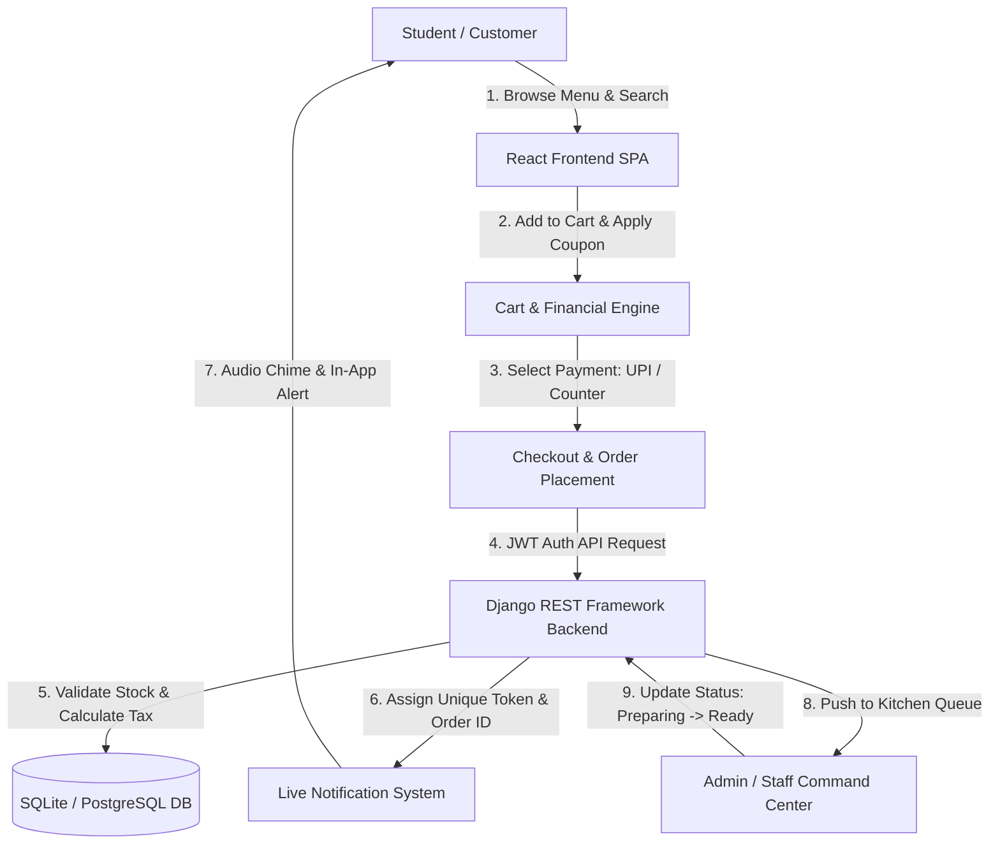

# 🍽️ CampusBite — Smart College Canteen Management System

> **A Production-Grade Full-Stack Web Platform** designed for university campus dining, contactless food ordering, real-time digital kitchen tokens, inventory control, and revenue analytics. Suitable for **B.Tech Final-Year Projects, College Demonstrations, GitHub Portfolios, and Technical Placement Interviews**.

---

## 🌟 Key Highlights & System Capabilities

- **⚡ Contactless Campus Ordering**: Students browse live menus, customize dietary preferences, apply coupons, and checkout in seconds.
- **🎫 Real-Time Digital Token Engine**: Generates unique timestamped order IDs (`CAN2026...`) and 4-digit digital tokens with printable counter receipts.
- **🔔 Web Audio Synthesized Chimes & Notifications**: Native browser Web Audio API chimes alert students when food enters preparation or is marked **"Ready for Pickup"** (zero external MP3 dependencies).
- **💳 Multi-Mode Payment Architecture**: Seamless support for **Pay at Canteen Counter**, **Interactive UPI QR Code Scanner** (dynamic VPA + countdown timer), and **Campus Smart Wallet**.
- **📊 Real-Time Operations Control Center**: Admin portal with live kitchen queue status switcher (`Placed → Confirmed → Preparing → Ready → Completed`), low-stock alerts, customer rosters, and CSV sales report generation.
- **⭐ Student Community Reviews & Ratings**: 5-star rating system with real-time score updates and student feedback.
- **🏷️ Smart Discounts & Offers**: Coupon validator engine (`WELCOME10`, `CAMPUS20`, `FESTIVAL50`) with minimum order threshold and maximum discount capping.

---

## 🛠️ Technology Stack

| Layer | Technologies |
| :--- | :--- |
| **Frontend** | React 19, Vite, Tailwind CSS, Lucide React, React Router 7, Axios, Web Audio API |
| **Backend** | Python 3.14 / 3.10+, Django 6.1, Django REST Framework (DRF), SimpleJWT |
| **Database** | SQLite (Zero-configuration local development) / PostgreSQL Ready |
| **Authentication**| JWT (JSON Web Tokens) with Role-Based Access Control (Student vs Admin/Staff) |

---

## 🏗️ System Architecture & Workflow



---

## 📋 Complete REST API Documentation

### 🔐 Authentication & Student Profile
| Method | Endpoint | Description | Access |
| :--- | :--- | :--- | :--- |
| `POST` | `/api/auth/register/` | Register new student with roll no & dept | Public |
| `POST` | `/api/auth/login/` | Authenticate user & return JWT tokens | Public |
| `GET` | `/api/auth/profile/` | Fetch current student profile & stats | Authenticated |
| `PUT` | `/api/auth/profile/` | Update avatar, contact, and student ID | Authenticated |

### 🍛 Food Categories & Menu
| Method | Endpoint | Description | Access |
| :--- | :--- | :--- | :--- |
| `GET` | `/api/categories/` | List all active categories | Public |
| `POST` | `/api/categories/` | Create a new category | Staff Admin |
| `GET` | `/api/foods/` | List food items with filters (`category`, `search`, `veg`, `available`, `sort`, `max_price`) | Public |
| `POST` | `/api/foods/` | Add new dish to menu | Staff Admin |
| `PATCH`| `/api/foods/<id>/toggle-availability/` | Quick stock availability toggle | Staff Admin |
| `DELETE`| `/api/foods/<id>/` | Remove food dish from menu | Staff Admin |

### 📦 Orders & Kitchen Queue
| Method | Endpoint | Description | Access |
| :--- | :--- | :--- | :--- |
| `POST` | `/api/orders/create/` | Place new order, compute GST & assign Token | Authenticated |
| `GET` | `/api/orders/my/` | List current user's active and past orders | Authenticated |
| `GET` | `/api/orders/all/` | Staff view of all orders with live polling | Staff Admin |
| `PATCH`| `/api/orders/<id>/status/` | Update status (`placed` → `confirmed` → `preparing` → `ready` → `completed`) | Staff Admin |

### 🎟️ Offers, Coupons & Reviews
| Method | Endpoint | Description | Access |
| :--- | :--- | :--- | :--- |
| `GET` | `/api/coupons/` | List active campus coupon discounts | Public |
| `POST` | `/api/coupons/validate/` | Validate coupon code against subtotal | Public |
| `GET` | `/api/foods/<id>/reviews/` | Fetch student reviews for a dish | Public |
| `POST` | `/api/foods/<id>/reviews/` | Submit a 5-star rating and comment | Authenticated |

### 📊 Admin Analytics & Reports
| Method | Endpoint | Description | Access |
| :--- | :--- | :--- | :--- |
| `GET` | `/api/admin/analytics/` | KPI counters, revenue, category sales, top items | Staff Admin |
| `GET` | `/api/admin/customers/` | Student roster with order counts & total spend | Staff Admin |
| `POST` | `/api/seed/` | Reseed realistic demo menu, categories & accounts | Public/Dev |

---

## 🚀 Quick Start Guide

### Prerequisites
- **Python 3.10+**
- **Node.js 18+** and **npm**

---

### Step 1: Backend Setup

```bash
# Navigate to the backend directory
cd backend

# Activate the virtual environment
# Windows:
.\venv\Scripts\activate
# Linux/macOS:
source venv/bin/activate

# Install dependencies
pip install -r requirements.txt

# Run migrations
python manage.py migrate

# (Optional) Seed realistic dishes, categories, and demo accounts:
python manage.py shell -c "from rest_framework.test import APIRequestFactory; from api.views import seed_demo_data; factory = APIRequestFactory(); request = factory.post('/api/seed/'); print(seed_demo_data(request).data)"

# Start the Django development server
python manage.py runserver 127.0.0.1:8000
```
Backend API will be accessible at `http://127.0.0.1:8000/api/`.

---

### Step 2: Frontend Setup

```bash
# In a new terminal, navigate to the frontend directory
cd frontend

# Install node modules
npm install

# Start Vite development server
npm run dev
```
Frontend web application will run at `http://localhost:5173/`.

---

## 🔑 Demo Credentials (1-Click Fill Ready)

| Role | Username | Password | Features Accessible |
| :--- | :--- | :--- | :--- |
| **Student** | `student` | `student123` | Menu, Cart, UPI Payment, Token Tracking, Profile, Reviews |
| **Admin** | `admin` | `admin123` | Kitchen Orders Table, Menu CRUD, Stock Toggles, Revenue Reports |

> **Tip**: The login page includes **"Instant Demo Logins"** buttons for 1-click filling during vivas and project evaluations.

---

## 🏷️ Active Demo Coupons

| Coupon Code | Discount | Minimum Order | Cap |
| :--- | :--- | :--- | :--- |
| `WELCOME10` | 10% OFF | ₹50.00 | ₹50.00 |
| `CAMPUS20` | 20% OFF | ₹150.00 | ₹100.00 |
| `FESTIVAL50` | 25% OFF | ₹200.00 | ₹120.00 |

---

## 🌐 Production Deployment Guide

### 1. Production Environment Variables (`.env`)
Create a `.env` file in the root:
```env
DEBUG=False
SECRET_KEY=generate_a_secure_random_key_here
ALLOWED_HOSTS=yourcanteen.college.edu,127.0.0.1
CORS_ALLOWED_ORIGINS=https://yourcanteen.college.edu
```

### 2. PostgreSQL Configuration (`settings.py`)
Replace `DATABASES` in `backend/canteen_api/settings.py`:
```python
DATABASES = {
    'default': {
        'ENGINE': 'django.db.backends.postgresql',
        'NAME': 'canteen_db',
        'USER': 'canteen_user',
        'PASSWORD': 'your_password',
        'HOST': 'localhost',
        'PORT': '5432',
    }
}
```

### 3. Production Frontend Bundle
```bash
cd frontend
npm run build
```
Upload the compiled `dist/` directory to Nginx, AWS S3, or Vercel.

### 4. Running Backend with Gunicorn & Nginx
```bash
pip install gunicorn
gunicorn canteen_api.wsgi:application --bind 0.0.0.0:8000 --workers 3
```

---

## 🎓 Academic Presentation Tips (B.Tech / Viva)
- **Problem Statement**: College canteens suffer from chaotic counter congestion during 30-minute breaks, unmanaged inventory shortages, and lack of digital record-keeping.
- **Proposed Solution**: A dual-interface smart ecosystem providing students with pre-ordering and digital token pickup while giving canteen managers real-time inventory visibility and sales analytics.
- **Key Technical Merits**: Clean REST architecture, JWT security, zero-audio-file native Web Audio synthesis, responsive mobile design without external UI component bloat, and automated stock deductions upon order placement.
